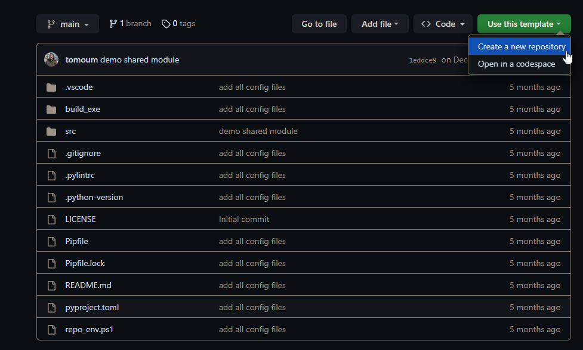

# 1. How to use this template?

When it comes to `python` there are so many ways to set up your development environment
and even more options when it comes to tooling. This template has multiple branches
that showcase some of those variations in tooling for managing your environment, compiling
your application and publishing to pypi or your private company servers for internal
python packages. For more information about python and development environment check out
my blog <https://www.muhabtomoum.com/>

1. Go through the different branches and figure out which tool set you prefer.
2. Click the big green button and select `Create a new Repository`

## 1.1. This branch

This branch uses `poetry` to manage the virtual environment, building and publishing the
`mypackage` python package. Poetry is a modern all in one python tool that is effective
and efficient. This is a pretty standard way to structure your python repo. This is
the template I use for most projects.

To start developing using this setup after you clone the repository:

1. `pip install poetry`
2. `poetry install` tell poetry to create a venv and install all required packages
   including developer packages.
3. `poetry shell` launch a shell inside the virtual environment.
4. `code .` launch vscode. Alternatively you can select the python interpreter associated
   with the virtual environment created in step 2.

For more information, see the documentation for [poetry](https://pypi.org/project/poetry/)

# 2. Repository Structure

## 2.1. src

All python code goes in the src folder

## 2.2. src/common

This is where all shared libraries go

## 2.3. docs

project documentation and assets such as screenshots or other media that
markdown files might reference.

## 2.4. external_dependencies

This is where any third party libraries or git submodules go. Anything you have
no direct control over in this Repository.

## 2.5. build_exe

This is where you can build your python application into a single executable to share
with others without having to install python.

## 2.6. Config Files

These are the dot files in the root of the project to configure the python tools.

1. `.python-version` - This file is used by `pyenv` to specify the exact version of
   Python required for the project, ensuring a consistent environment across different setups.
1. `pyproject.toml` - This is a configuration file used to store metadata and build
   settings for the project, serving as a unified configuration file for various tools,
   like build systems and package managers, in Python projects.
1. `.markdownlint.jsonc` - This file contains configuration settings for the
   Markdownlint tool, which is used to enforce consistent formatting and style rules
   for Markdown documents in your project.
1. `.pre-commit-config.yaml` - This file is used to configure pre-commit hooks, which
   are scripts that run automatically before each commit, helping to catch and prevent
   common coding issues, enforce coding standards, and ensure that your codebase remains
    clean and maintainable.
1. `cspell.json` - This file contains configuration settings for the cSpell tool, a
   spell checker designed specifically for code, which helps identify and correct
   spelling mistakes in your source code, comments, and documentation.
1. `.editorconfig` - This file is used to define and maintain consistent coding styles
   and formatting settings, such as indentation and line endings, across different
   text editors and IDEs, making it easier for developers to collaborate on a project.
1. `poetry.lock` - This file is a snapshot of the exact versions of all dependencies,
   generated by the Poetry package manager from the `pyproject.toml` file, ensuring that
   the same dependencies are installed across different environments for a consistent
   development experience.
